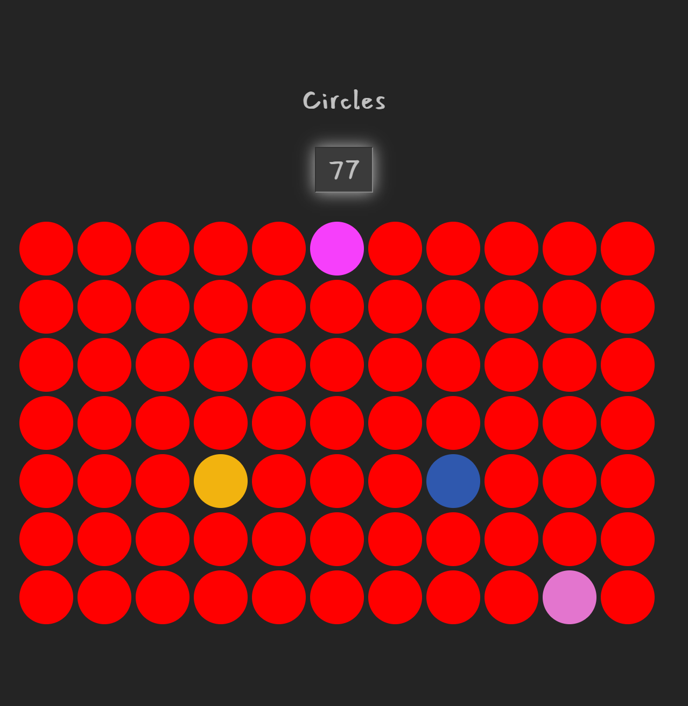

# Change Color

## Screenshot

## Description

The App displays an array of red circles.
 
The circles' colors can be changed individually to a random color by clicking on them.
 
The amount of circles can be adjusted from the input field.

## Installing and start up

Install dependencies by running the command npm install.
 
Start the program by running the command npm run dev in the terminal.

## Project details

This project is made with React+Vite and runs on localhost (http://127.0.0.1:5173/).

## Design decisions

The App is written using Hooks (New React).
 
The App is divided into components that use helpers from the utils folder.
 
Styles are created with CSS.
 
The fonts are copied to App.css from Fontsource CDN page and used in the style constant in App.jsx.

## Known errors

-
